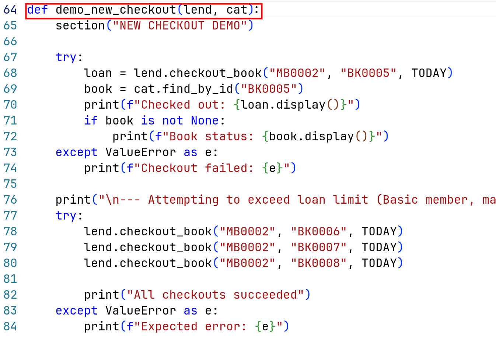
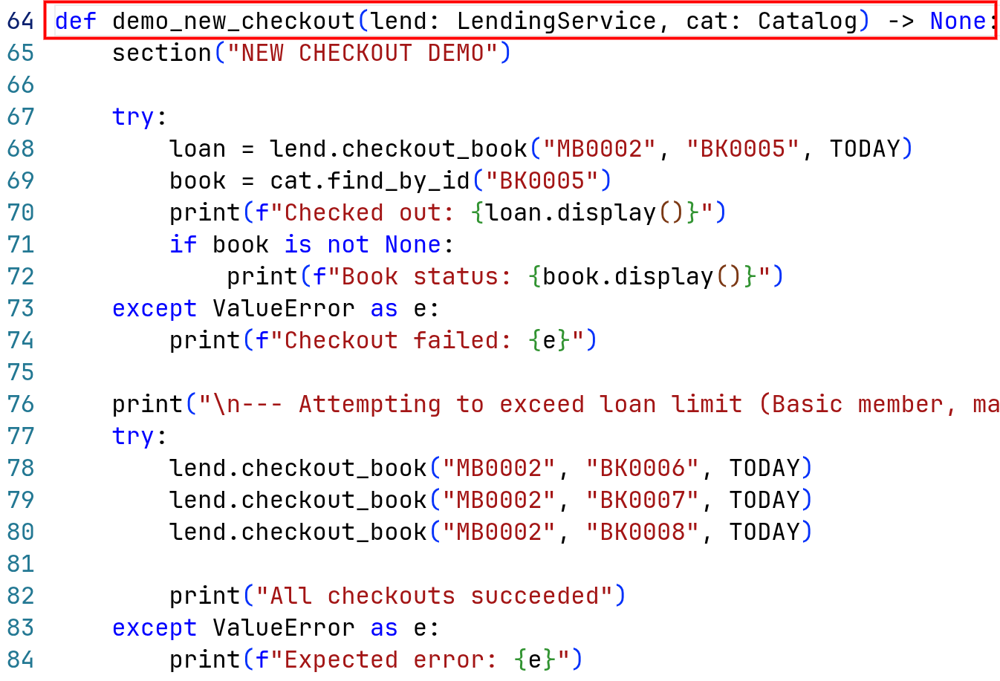
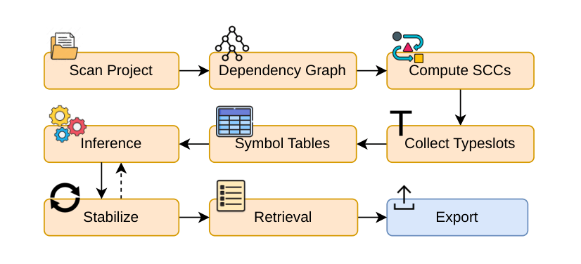
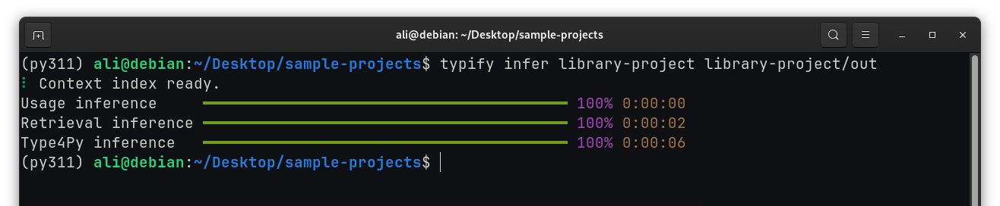

# Typify


**Typify** is a usage-driven Python type inference system that automatically infers types for unannotated Python codebases.

---

## Motivation

Python is one of the most widely used programming languages in the world, yet the vast majority of real-world Python code remains unannotated. Studies show that fewer than 10% of annotatable code elements carry explicit type annotations. This creates real problems for developers: without type information, IDEs cannot offer reliable autocompletion, refactoring tools operate blindly, and entire classes of bugs go undetected until runtime.

| Without annotations | With annotations |
|---|---|
|  |  |

Adding annotations manually is tedious and error-prone, especially in large or legacy codebases. The goal of Typify is to automate this process, recovering precise type information across an entire project without requiring developers to write a single annotation by hand.

---

## Approach

Typify is a purely static type inference engine. It builds a dependency graph of the entire project, schedules modules in topological order, and propagates type information across functions, classes, and module boundaries using iterative fixpoint analysis.

<div style="text-align: center;">
  
</div>

The core insight is **usage-driven inference**: types are inferred not from declarations, but from how variables and functions are actually used throughout the codebase.

### Example

Consider a function with no annotations:

```python
def add(x, y):
    return x + y
```

Somewhere else in the project, it is called like this:

```python
add(10, "hello")
```

Existing tools treat each function in isolation and cannot infer anything about `x` or `y` without explicit annotations. Typify traces the call site, observes that `10` is an `int` and `"hello"` is a `str`, and propagates these types back to the parameters, inferring `x: int` and `y: str` without any annotations.

This call-site propagation works recursively and cross-module, meaning types flow naturally through the entire project as Typify analyzes it.

Unlike local-only inference tools, Typify uses a **whole-project usage-driven analysis**. It tracks how values flow across files and function calls, allowing it to infer precise types such as:

```python
list[dict[str, list[str]]]
```

instead of broad approximations like `list` or `Any`.

---

## Evaluation

Typify was evaluated on two benchmark datasets, **ManyTypes4Py** and **Typilus**, against static checkers (Pyright, Pyre Infer), a deep learning model (Type4Py), and the state-of-the-art hybrid system (HiTyper).

Key findings:

- Typify substantially outperforms all static checkers, with exact-match accuracy up to **55.9%** overall on ManyTypes4Py vs. Pyre Infer's **10.4%**.
- Typify closely trails HiTyper despite using no machine learning, running at **4.7 ms per data point** vs. HiTyper's **48.2 ms**, a 90% reduction in latency.
- When combined with Type4Py, Typify **outperforms HiTyper** across nearly all tasks and datasets.

### Feature Comparison

| Tool | No annotations needed | Usage-driven inference | Cross-module / whole-project | Deterministic & reproducible | ML-based predictions |
|---|:---:|:---:|:---:|:---:|:---:|
| Pyright | ✕ | ✕ | ✓ | ✓ | ✕ |
| Pyre | ✕ | ✕ | ✕ | ✓ | ✕ |
| Type4Py | ✓ | ✕ | ✕ | ✕ | ✓ |
| HiTyper | ✓ | ✕ | ✕ | ✓ | ✓ |
| **Typify** | **✓** | **✓** | **✓** | **✓** | **✓** |

As shown above, Typify stands out because it combines analysis of the entire project with predictable execution, while also supporting optional ML features. Unlike many existing tools, it does not focus on just one strength at the expense of others.

---

## Installation

Requires **Python 3.11 or higher**.

```bash
pip install typify-cli
```

### Dependencies

The following packages are installed automatically by the above command: `tantivy`, `rich`, `gdown`, and `requests`.

### Example Project

A sample Python project is available for download to experiment with Typify right away.

[Download example project](/content/typify/library-project.zip)

Extract the archive, navigate to the project root, set up a Python virtual environment, install the project dependencies, then install `typify-cli`:

```bash
python -m venv .venv
source .venv/bin/activate       # Windows: .venv\Scripts\activate
pip install -r requirements.txt
pip install typify-cli
```

The demo video below walks through this setup and runs Typify on the example project.

[](https://youtu.be/ANkhv1dci3s)

---

## How Typify Works

The analysis pipeline consists of several stages:

1. **Dependency graph construction** - builds a project-wide import graph and handles circular imports through fixpoint iteration.

2. **Usage-driven inference** - infers types from assignments, operators, method calls, and usage patterns. Types accumulate monotonically over time.

3. **Propagation passes** - re-applies inferred call-site information across multiple rounds, resolving increasingly deep call chains.

4. **Context-matching retrieval** - queries a search index of annotated Python code for unresolved slots.

5. **Type4Py integration** - uses neural predictions for remaining unresolved cases.

---

## Usage

### Inference

```bash
Usage: typify infer [PROJECT-PATH] [OUTPUT-PATH] [OPTIONS]

Arguments:
  PROJECT-PATH    Path to the project directory
  OUTPUT-PATH     Output directory to write inferred types into

Options:
  --config PATH   Path to a config file to configure inference
```

### Output Structure

The output directory contains:

```text
types/           # JSON type outputs per file
index.json       # Source-to-output mapping
config.json      # Analyzer configuration
context-index/   # Retrieval index
```



Subsequent runs are incremental: only changed files are reprocessed by retrieval and Type4Py passes.

See [schema.md](schema.md) for the full output format.

---

## Configuration

On first run, Typify writes a default `config.json`:

```json
{
    "context-retrieval": true,
    "context-index-download": "<gdrive-url>",
    "retrieval-top-k": 5,
    "type4py": true,
    "type4py-api-url": "https://type4py.ali-aman.ca/api/predict?tc=0",
    "augment-context": false,
    "propagation-passes": 3,
    "symbolic-depth": 3
}
```

| Field                    | Description                         |
| ------------------------ | ----------------------------------- |
| `context-retrieval`      | Enable retrieval-based inference    |
| `context-index-download` | Retrieval index download URL        |
| `retrieval-top-k`        | Number of retrieved candidates      |
| `type4py`                | Enable Type4Py integration          |
| `type4py-api-url`        | Type4Py API endpoint                |
| `augment-context`        | Experimental retrieval augmentation |
| `propagation-passes`     | Number of propagation rounds        |
| `symbolic-depth`         | Symbolic execution recursion depth  |

For more details, refer to the links at the bottom of the page.

---

## Building a Custom Retrieval Index

Researchers can build their own retrieval indexes using:

```bash
Usage: typify build [DATASET-PATH] [INDEX-PATH] [OPTIONS]

Arguments:
  DATASET-PATH    Path to the dataset directory
  INDEX-PATH      Output directory to write the retrieval index into

Options:
  --workers N     Number of parallel workers to use during index construction
```

Supported datasets include:

- ManyTypes4Py
- Typilus
- Any annotated Python corpus

This enables experimentation with domain-specific retrieval corpora.

---

## Batch Inference and Evaluation

For large-scale analysis across entire datasets, such as benchmarking Typify against a corpus of Python projects, `typify-cli` provides three commands that together form an end-to-end evaluation pipeline: ground-truth extraction, batch inference, and result comparison. The command-line interface for batch inference is being worked on due to some minor porting issues, so it may be slightly inconsistent in this area.

### `typify gt` - Ground-Truth Extraction

Extracts type annotations from an already-annotated dataset, producing a JSON file that serves as the reference ground truth for evaluation. Run this first on any dataset that contains existing annotations.

```bash
Usage: typify gt [DATASET-PATH] [OUTPUT-PATH]

Arguments:
  DATASET-PATH    Path to the dataset directory
  OUTPUT-PATH     Output JSON file to write extracted annotations into
```

---

### `typify dataset` - Batch Inference

Runs Typify's inference engine over an entire dataset directory, processing each project and writing predicted types to a JSON output file.

```bash
Usage: typify dataset [DATASET-PATH] [OUTPUT-PATH] [OPTIONS]

Arguments:
  DATASET-PATH    Path to the dataset directory
  OUTPUT-PATH     Output JSON file for inferred type predictions

Options:
  --config PATH   Path to a config file to configure inference
```

---

### `typify eval` - Evaluation

Compares Typify's predictions against the ground truth produced by `typify gt`, reporting accuracy using both exact-match and base-type matching.

```bash
Usage: typify eval [GT-PATH] [TOOL-PATH]

Arguments:
  GT-PATH      Ground-truth JSON file produced by typify gt
  TOOL-PATH    Inference output JSON file produced by typify dataset
```

---

# Links

- [Typify CLI Repository](https://github.com/ali-aman-burki/typify-cli)
- [VS Code Extension Repository](https://github.com/for-loop9/typify-vscode)
- [VS Code Marketplace](https://marketplace.visualstudio.com/items?itemName=amanh.typify)
- [Type4Py](https://github.com/saltudelft/type4py)
- [ICPC 2026 Paper](https://doi.org/10.1145/3794763.3794825)

---
The full technical paper containing the technique description and evaluation results was published at the *34th IEEE/ACM International Conference on Program Comprehension (ICPC 2026)*, Rio de Janeiro, Brazil.

*Typify is a research project from the University of Windsor, supported by the Natural Sciences and Engineering Research Council of Canada (NSERC).*
