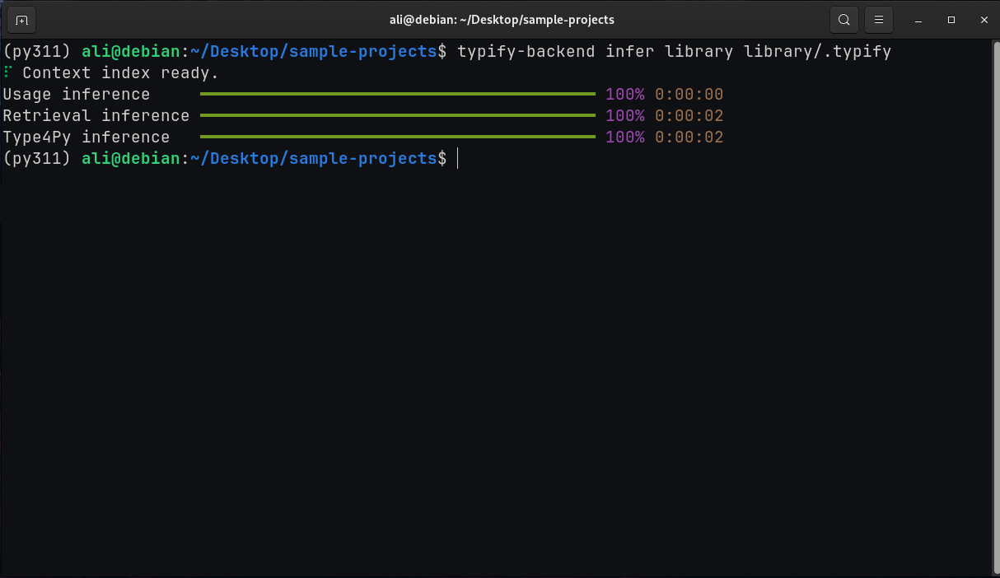

# typify-cli

Backend CLI for **Typify**, a lightweight usage-driven static analyzer for precise Python type inference. Published at the *34th IEEE/ACM International Conference on Program Comprehension (ICPC 2026)*, Rio de Janeiro, Brazil.

Typify infers types for variables, function parameters, and return values in unannotated Python codebases — no training data or existing annotations required.

## How it works

Typify's core contribution is **usage-driven inference**: rather than treating each function in isolation, Typify looks at how a function is actually called across the project and propagates the concrete argument types back to the function's parameters. For example, if `process(items)` is called with a `list[str]`, Typify infers that the `items` parameter is `list[str]` and carries that type into the function body to resolve further expressions.

This works through several stages run in order:

1. **Dependency graph construction** — Typify scans all modules and builds a project-wide import graph, determining the order in which modules should be analyzed (topological order, with fixpoint iteration for circular imports).
2. **Usage-driven inference** — The engine traverses each module statement by statement, inferring types from assignments, method calls, and operators. Types accumulate monotonically (e.g. `x = []` → `list`, then `x.append(1)` → `list[int]`).
3. **Propagation passes** — Multiple rounds of call-site application and re-inference allow types to propagate through chains of function calls, resolving one additional level of depth per pass.
4. **Context-matching retrieval** — For slots that remain unresolved after usage-driven inference (e.g. uncalled functions), Typify queries a pre-built search index of annotated code to suggest candidate types based on local context similarity.
5. **Type4Py integration** — Optionally queries the Type4Py API to fill remaining gaps with deep-learning predictions.

## Installation

```
pip install typify-cli
```

## Usage

### Inference

```
typify infer <project_directory> <output_directory>
```

- `project_directory` — root of the Python project to analyze. Typify recursively finds all `.py` files within it.
- `output_directory` — where results are written. Contains:
  - `types/` — one JSON file per source file with inferred types for every resolved identifier
  - `index.json` — maps each source path (relative to `project_directory`) to its output JSON file
  - `config.json` — created on first run with default settings; edit to tune behaviour
  - `context-index/` — the downloaded retrieval index (auto-downloaded on first run if retrieval is enabled)



See [schema.md](schema.md) for the full output format. This output is intended to be consumed by the **Typify VS Code extension**.

Subsequent runs on the same output directory are incremental — only files that changed since the last run are re-processed by the retrieval and Type4Py passes.

### Configuration

On first run, a `config.json` is written to the output directory with all defaults. Edit it to tune behaviour:

```json
{
    "context-retrieval": true,
    "context-index-download": "<gdrive-url>",
    "retrieval-top-k": 5,
    "type4py": true,
    "type4py-api-url": "https://type4py.ali-aman.ca/api/predict?tc=0",
    "augment-context": false,
    "propagation-passes": 3,
    "symbolic-depth": 3
}
```

| Field | Description |
|---|---|
| `context-retrieval` | Enable the context-matching retrieval pass. If enabled and no index exists locally, it is downloaded automatically. |
| `context-index-download` | URL to download the pre-built retrieval index from. Override this to point to your own index. |
| `retrieval-top-k` | Number of candidate types retrieved per slot; the top result is used. |
| `type4py` | Enable the Type4Py deep-learning pass for slots still unresolved after retrieval. |
| `type4py-api-url` | Type4Py API endpoint. Can be changed to a self-hosted instance. |
| `augment-context` | **Experimental.** When enabled, augments the retrieval query context with type annotations already present in the user's own codebase, improving retrieval for project-specific types. Under active development. |
| `propagation-passes` | Number of call-site propagation rounds. More passes resolve longer call chains but take longer. |
| `symbolic-depth` | Maximum recursion depth during per-callsite symbolic execution of return types. |

For more details on the symbolic execution technique and how these parameters affect inference, refer to the [ICPC 2026 paper](https://doi.org/10.1145/3794763.3794825).

### Building a custom retrieval index

The `build` command lets researchers build their own retrieval index from any annotated Python dataset (e.g. ManyTypes4Py, Typilus, or a private codebase):

```
typify build <dataset_root> <index_directory> [--workers N]
```

- `dataset_root` — root of an annotated Python dataset (e.g. ManyTypes4Py, Typilus, or any collection of `.py` files with type annotations). Typify recursively walks the tree extracting all annotated type slots and their surrounding context.
- `index_directory` — where the Tantivy search index is written. Point `context-index-download` in `config.json` to this path (or host it and update the URL) to use it during inference.
- `--workers N` — number of parallel worker processes for indexing (default: 4).

This makes it straightforward to experiment with domain-specific or larger corpora to improve retrieval coverage in specialized settings.

## Replication

The replication package for the ICPC 2026 paper is available at [https://github.com/ali-aman-burki/typify](https://github.com/ali-aman-burki/typify). It contains everything needed to reproduce the empirical results from the paper, including scripts for batch processing large datasets (ManyTypes4Py and Typilus), the full experimental evaluation pipeline, baseline comparisons, and result analysis. Researchers looking to reproduce or extend the evaluation should refer to that repository rather than this CLI.
